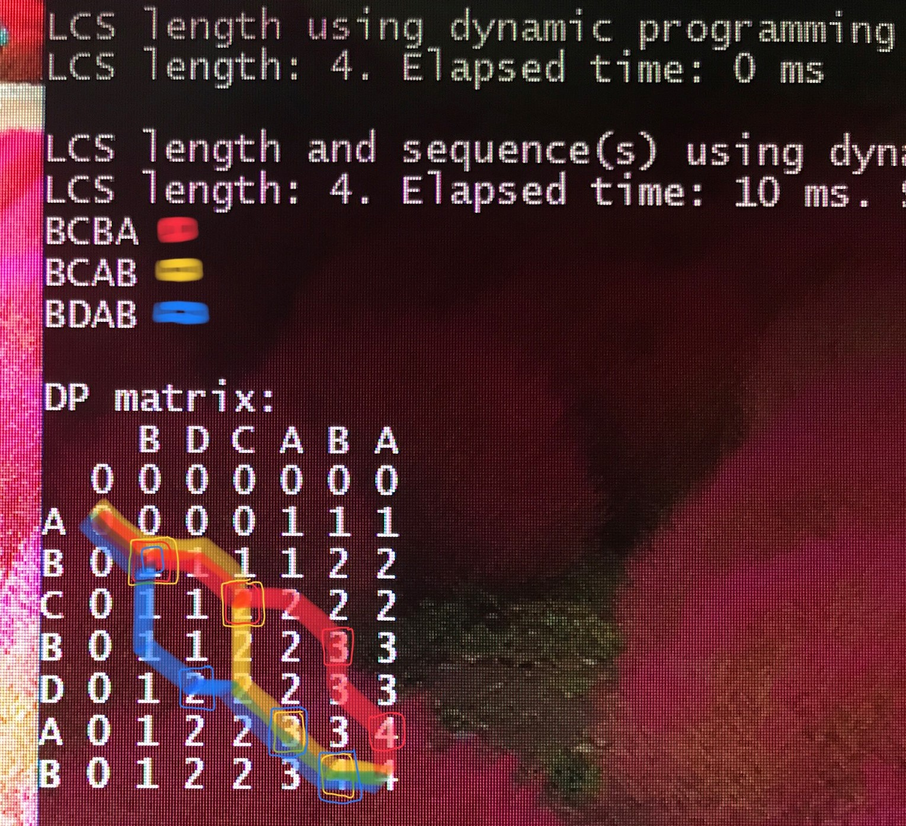
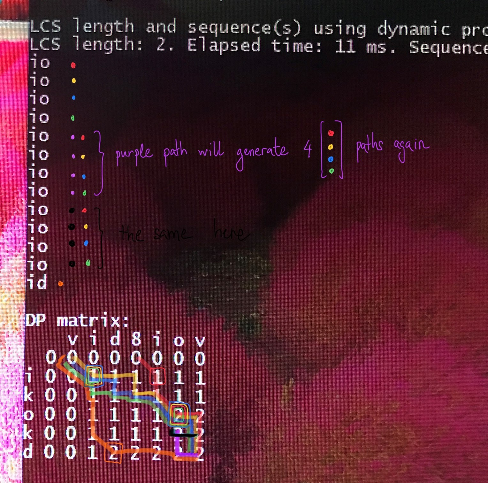
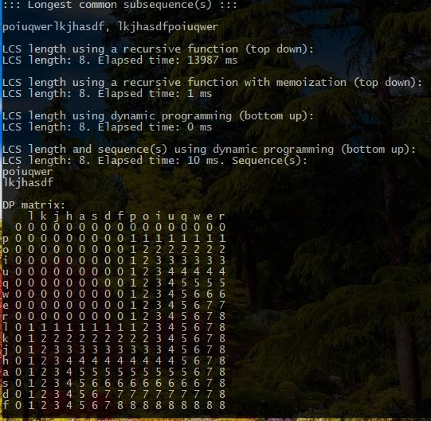

# LongestCommonSubsequence
Solves Longest Common Subsequence problem using Dynamic Programming, length and all subsequences.

It uses three different approaches:
* Recursive
* Recursive + Memoization
* Dynamic Programming

## Examples

In this first example, you can see how subsequences are generated based on the Dynamic Programming matrix.

In this second example, you can see how subsequences are generated based on the Dynamic Programming matrix.
Note that in this case there are multiple duplicates due to the different generating paths.
This is not an issue to me since it reflects the different paths. In case you want to show only != subsequences
just process the given output.

In this last example we can understand the different algorithm's performance.
* Recursive solution does not scale. O(2^(n+m))
* Recursive + memoization scales. O(n x m)
* Dynamic Programming scales. O(n x m)

